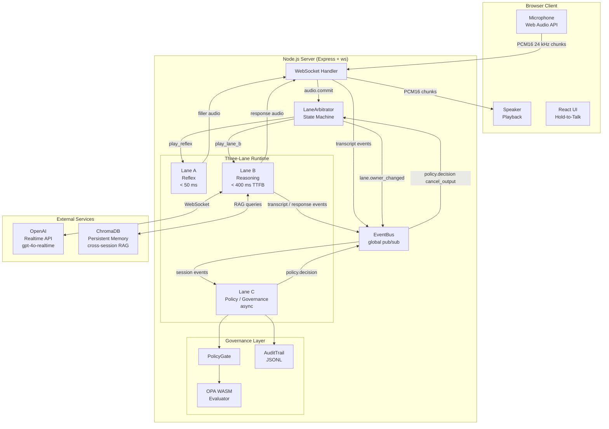
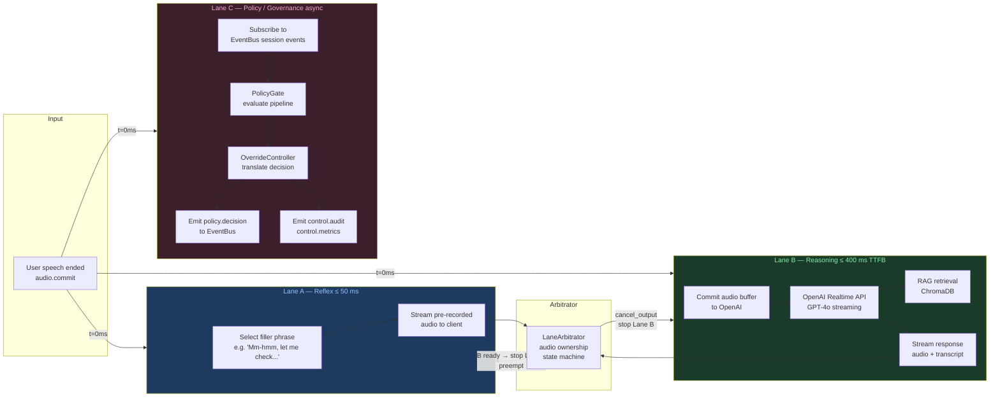
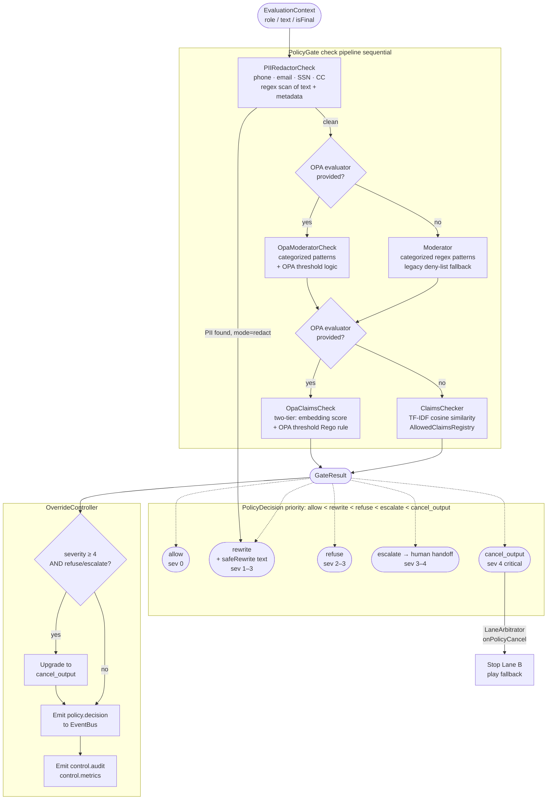
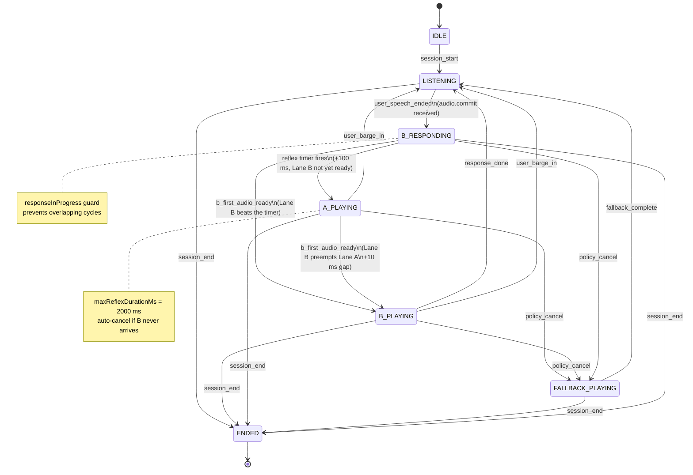
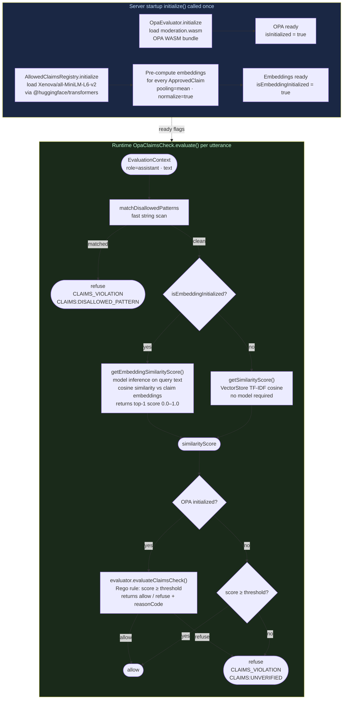

# voice-jib-jab — System Architecture

**Project**: P-07 (Voice & Media vertical)
**Last Updated**: 2026-03-18
**Status**: Production

---

## 1. System Overview

Client audio streams over WebSocket to an Express/Node server. The server runs three parallel lanes and routes output through OpenAI's Realtime API. All lane decisions pass through the EventBus; ChromaDB provides cross-session memory for RAG; OPA WASM governs moderation thresholds.

---

## 2. Three-Lane Architecture

All three lanes start concurrently the moment the user stops speaking. Lane A covers perceived latency; Lane B delivers the actual response; Lane C enforces governance without blocking Lane B.

---

## 3. Lane C PolicyGate Flow

Checks run sequentially in severity order. First check to produce a non-`allow` decision at the highest priority wins. OPA WASM overrides the TypeScript result when initialized. The OverrideController escalates `refuse`/`escalate` at severity ≥ 4 to `cancel_output`.

---

## 4. LaneArbitrator State Machine

Audio ownership is exclusive; only one lane may produce output at a time. Barge-in and policy cancel both force an immediate return to `LISTENING`.

---

## 5. Dense Embedding Pipeline (N-15)

`AllowedClaimsRegistry.initialize()` runs once at server startup (alongside OPA WASM load). At evaluation time, `OpaClaimsCheck` selects between dense embedding cosine similarity and TF-IDF fallback based on `isEmbeddingInitialized`.

---

## Key Numbers

| Metric | Target | Source |
|---|---|---|
| Lane A latency | < 50 ms | CLAUDE.md architecture constraint |
| Lane B TTFB | < 400 ms | Measured ~350 ms |
| LaneArbitrator reflex delay | 100 ms | `minDelayBeforeReflexMs` default |
| Reflex max duration | 2000 ms | `maxReflexDurationMs` default |
| Lane A → B transition gap | 10 ms | `transitionGapMs` default |
| OPA cancel threshold severity | 4 (critical) | `cancelOutputThreshold` default |
| OpaClaimsCheck default threshold | 0.6 cosine | `opaClaimsThreshold` default |
| Embedding model | `Xenova/all-MiniLM-L6-v2` | `EMBEDDING_MODEL` env var |
| Test coverage floor | 88% stmt / 78% branch / 87% fn | `jest.config.js` |
