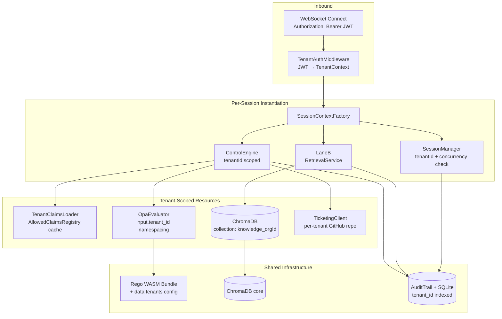

# N-13 Multi-Tenant Isolation — Research Document

**Initiative**: N-13 | **Pillar**: GOVERNANCE | **Status**: RESEARCHED
**Author**: voice-jib-jab team | **Date**: 2026-03-18
**Informs**: Next implementation directive for N-13

---

## Executive Summary

Multi-tenant isolation requires five boundary surfaces: session context, knowledge retrieval, claims policy, OPA moderation policy, and audit trails. The current architecture is single-tenant by design — all shared singletons. This doc proposes a `TenantContext` carrier object that threads through all five surfaces with zero changes to the three-lane audio loop.

---

## Current Architecture (Single-Tenant)

```
WebSocket connect
  └─ VoiceWebSocketHandler
       ├─ ControlEngine(sessionId, { opaEvaluator: shared })
       │    └─ AllowedClaimsRegistry (DEFAULT_CONFIG — global)
       ├─ LaneB (RetrievalService — global, one knowledge pack)
       └─ SessionManager (no org/tenant concept)
```

**Shared singletons (isolation gaps):**

| Component | Current State | Isolation Risk |
|---|---|---|
| `AllowedClaimsRegistry` | Global default in `laneC_control.ts` DEFAULT_CONFIG | Tenant A's approved claims leak to Tenant B |
| `OpaEvaluator` | One instance per server process, passed into handler constructor | All tenants share same Rego policies |
| `RetrievalService` | One global knowledge pack, loaded from disk at startup | Tenant A's proprietary facts visible to Tenant B |
| `VectorStore<KnowledgeFact>` | In-memory, inside RetrievalService | Same as above |
| `AuditTrail` / `SessionHistory` | Stored by sessionId, no tenantId column | Cross-tenant audit queries possible |
| `SessionManager` | Tracks `{ id, state, createdAt }` only — no orgId | No tenant-level rate limiting |

---

## Proposed Architecture

### Tenant Context Carrier

```typescript
export interface TenantContext {
  tenantId: string;       // e.g. "org_acme" — from JWT sub claim or API key
  orgName: string;        // display name
  tier: "starter" | "pro" | "enterprise";
  features: {
    maxConcurrentSessions: number;
    customClaimsEnabled: boolean;
    customPolicyEnabled: boolean;
    knowledgePackId: string;  // which knowledge collection to use
  };
}
```

Extracted at WebSocket upgrade time from:
- `Authorization: Bearer <JWT>` → `sub` claim = tenantId
- `X-API-Key` header → lookup in tenant registry table

---

### Surface 1: Knowledge Retrieval (ChromaDB collections)

**Current**: Single in-memory `VectorStore<KnowledgeFact>` inside `RetrievalService`.

**Target**: ChromaDB with one collection per tenant.

```
ChromaDB
├── collection: "knowledge_org_acme"
├── collection: "knowledge_org_globocorp"
└── collection: "knowledge__default"   ← fallback for unauthenticated/free tier
```

**Implementation approach**:
- `RetrievalService` gains a `tenantId` constructor param (or factory method)
- `VectorStore` replaced by `ChromaDbVectorStore` implementing the same interface
- Collection name = `knowledge_${tenantId}` — created on first tenant onboard
- Knowledge pack admin API: `POST /admin/tenants/:id/knowledge` → ingest into tenant collection
- Fallback: if tenant collection empty → use `knowledge__default`

**Why ChromaDB (not Postgres pgvector)**:
- Already referenced in CLAUDE.md as the project's vector store
- Native collection namespacing — no SQL schema migration needed per tenant
- Existing `VectorStore` interface is a drop-in swap surface

---

### Surface 2: Claims Registry (per-tenant AllowedClaims)

**Current**: `AllowedClaimsRegistry` created from `DEFAULT_CONFIG` in `laneC_control.ts` line 138.

**Target**: Registry loaded from per-tenant config, injected at session creation.

```typescript
// TenantClaimsLoader (new service)
export class TenantClaimsLoader {
  private cache = new Map<string, AllowedClaimsRegistry>();

  async getRegistry(tenantId: string): Promise<AllowedClaimsRegistry> {
    if (this.cache.has(tenantId)) return this.cache.get(tenantId)!;
    const config = await this.loadTenantClaimsConfig(tenantId);
    const registry = new AllowedClaimsRegistry(config);
    await registry.initialize();
    this.cache.set(tenantId, registry);
    return registry;
  }
}
```

**Isolation guarantee**: Tenant A's `["FDA approved", "30-day guarantee"]` claims never evaluated against Tenant B's output.

**Sharing allowed**: Two tenants may use the same registry instance if they share a `knowledgePackId` (e.g. both on free tier with default claims). Cache key = `knowledgePackId` instead of `tenantId` in that case.

---

### Surface 3: OPA Policy Namespacing

**Current**: One `OpaEvaluator` with one compiled WASM bundle. All sessions use same Rego rules.

**Target**: Tenant-specific policy via OPA input namespacing (no separate WASM bundles needed).

**Approach A — Input namespacing (recommended, low complexity):**

```rego
# moderation.rego
package moderation

default allow = false

# Global rules apply to all tenants
allow if {
    input.severity < data.tenants[input.tenant_id].moderation_threshold
}

# Tenant-specific overrides
allow if {
    data.tenants[input.tenant_id].whitelist_categories[_] == input.category
}
```

The `OpaEvaluator.evaluate()` call gains `tenantId` in its input object. OPA's `data` document holds a `tenants` map loaded from a config file or DB.

**Approach B — Per-tenant WASM bundles (enterprise only):**

Compile separate `.wasm` per tenant with their custom Rego. Higher isolation, higher operational cost. Warranted only for regulated industries (healthcare, finance) requiring auditable policy artifacts.

**Recommendation**: Ship Approach A. Add Approach B as a feature flag behind `tier === "enterprise"`.

---

### Surface 4: Audit Trail Tenant Scoping

**Current**: `AuditTrail` writes records with `sessionId` only. `SessionHistory` SQLite table has no `tenantId` column.

**Target**: Add `tenant_id` column to all audit tables.

```sql
-- Migration
ALTER TABLE audit_events   ADD COLUMN tenant_id TEXT NOT NULL DEFAULT '';
ALTER TABLE session_history ADD COLUMN tenant_id TEXT NOT NULL DEFAULT '';

CREATE INDEX idx_audit_tenant    ON audit_events(tenant_id, created_at);
CREATE INDEX idx_session_tenant  ON session_history(tenant_id, created_at);
```

**API scoping**: All audit query endpoints (e.g. `GET /api/audit`) filter by `tenantId` extracted from the request JWT. Cross-tenant audit queries blocked at the API layer.

---

### Surface 5: Session Manager — Tenant Awareness

**Current**: `SessionManager.createSession()` returns `{ id, state, createdAt }`.

**Target**: Add `tenantId` and enforce per-tenant concurrency limits.

```typescript
// SessionManager (modified)
interface Session {
  id: string;
  tenantId: string;       // ← new
  state: SessionState;
  createdAt: number;
}

createSession(params: { tenantId: string; ... }): Session {
  const active = this.getActiveSessionCount(params.tenantId);
  const limit = this.getTenantLimit(params.tenantId);
  if (active >= limit) throw new TenantSessionLimitError(params.tenantId, limit);
  // ...
}
```

---

## Architecture Diagram



---

## Migration Path (3 Phases)

### Phase 1 — Tenant identity (no isolation yet)
1. Add `TenantContext` type
2. Extract `tenantId` from JWT at WebSocket upgrade
3. Thread `tenantId` into `SessionManager` and `AuditTrail`
4. Add `tenant_id` columns + indexes to SQLite audit tables
5. **Isolation**: zero (same policies/knowledge, but tenantId tracked)

### Phase 2 — Claims + Policy isolation
1. `TenantClaimsLoader` with cache
2. OPA input namespacing + `data.tenants` config file
3. `ControlEngineConfig.claimsRegistry` injected per-session (already injectable — line 104)
4. Admin API: `POST /admin/tenants/:id/claims`
5. **Isolation**: claims + moderation thresholds isolated

### Phase 3 — Knowledge isolation (ChromaDB collections)
1. Replace `VectorStore` with `ChromaDbVectorStore` (same interface)
2. `RetrievalService` factory: `createForTenant(tenantId)`
3. Knowledge pack admin API
4. Seed default collection from existing `data/knowledge/`
5. **Isolation**: full — knowledge, claims, policy, audit all scoped

---

## Key Design Decisions

| Decision | Choice | Rationale |
|---|---|---|
| ChromaDB collection naming | `knowledge_{tenantId}` | Simple, no schema migration; ChromaDB native |
| OPA isolation strategy | Input namespacing (Phase 2), optional per-tenant WASM (enterprise) | Input namespacing is zero-ops; WASM per-tenant is costly |
| Claims registry caching | Cache by `knowledgePackId` not `tenantId` | Enables free-tier sharing without data leak |
| Concurrency enforcement | `SessionManager` (not API gateway) | Keeps enforcement co-located with session lifecycle |
| Backward compat | `tenantId` defaults to `"__default"` | Zero breaking change for existing single-tenant deployments |

---

## Open Questions for Asif / CoS

1. **ChromaDB hosting**: Self-hosted Docker container in prod, or managed cloud (e.g. Chroma Cloud)? Affects Phase 3 timeline.
2. **Tenant onboarding flow**: Admin UI or CLI/API only for MVP?
3. **OPA enterprise tier**: Should per-tenant WASM compilation be in scope for N-13, or a separate N-16?
4. **Knowledge pack ingestion**: Does enterprise tier support tenant-uploaded PDFs/docs, or is it always admin-managed?

---

## Effort Estimates

| Phase | Effort | Risk |
|---|---|---|
| Phase 1 (identity + audit) | S (2–3 days) | Low — purely additive |
| Phase 2 (claims + OPA) | M (4–5 days) | Medium — OPA data.tenants config design |
| Phase 3 (ChromaDB) | L (7–10 days) | High — VectorStore swap + ChromaDB ops |

**Total N-13**: ~3 sprints. Recommend phased delivery with Phase 1 as an immediate directive.
